## EJECUCIÓN PRUEBA FINAL DEL FLUJO DEL MVP CON UNA IMAGEN CATALOGADA COMO IA Y UNA COMO REAL

1. Pantalla inicial de la aplicación.
Se muestra la interfaz principal que visualiza el usuario al ingresar a la aplicación.
 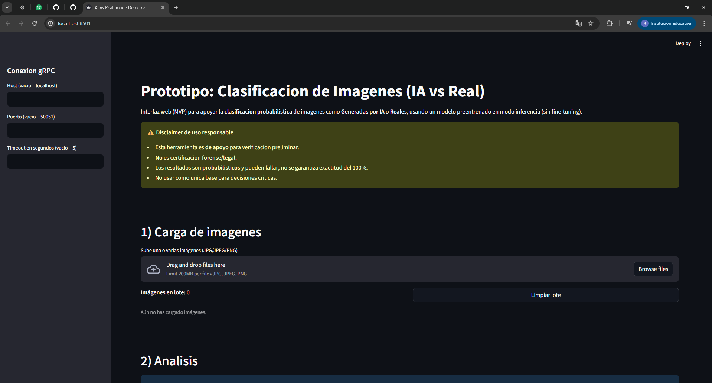
2. Carga de imágenes.
Se utilizan las imágenes “Polar.jpg” e “IA1.jpg” mediante el botón “Browse Files”.
Ambas aparecen en el sistema con estado “Pending”, indicando que están listas para ser procesadas.

3. Inicio del procesamiento.
Al presionar el botón “Analizar imágenes”, el sistema procesa ambas imágenes y su estado cambia a “Éxito”, confirmando que el análisis se completó correctamente.
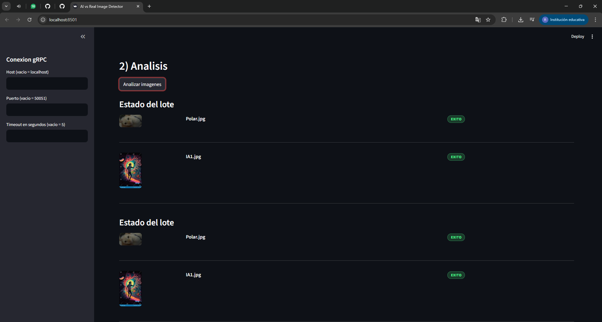
4. Resultados del análisis.
En la tabla de resultados se observa que la imagen "Polar" es clasificada con la etiqueta "real" y la imagen "IA1" es clasificada con la etiqueta "ai" comprobando que los resultados de clasificación se generan correctamente.
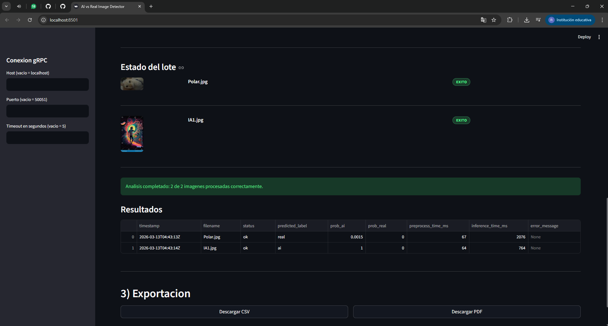
5. Descarga de resultados en CSV.
Se verifica el funcionamiento del botón “Descargar CSV”, comprobando que el archivo se genera correctamente con los resultados obtenidos.
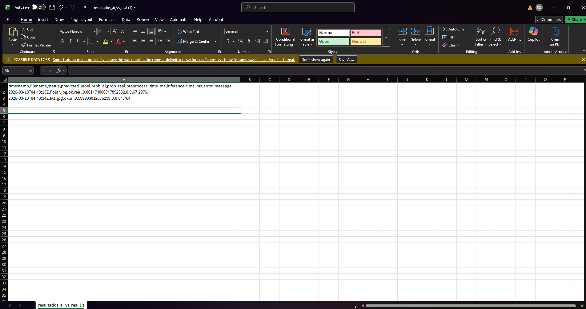
6. Generación del reporte en PDF.
Se valida el funcionamiento del botón “Descargar PDF”, comprobando que el documento contiene correctamente todas las páginas del reporte generado.
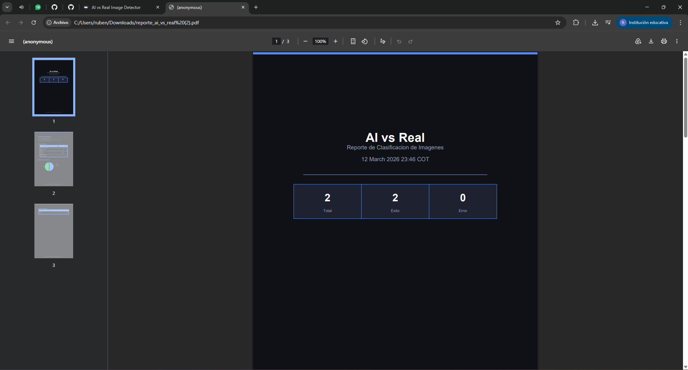
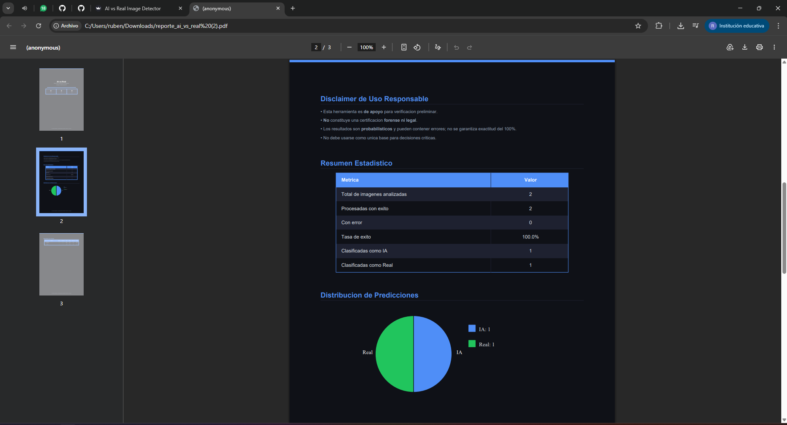
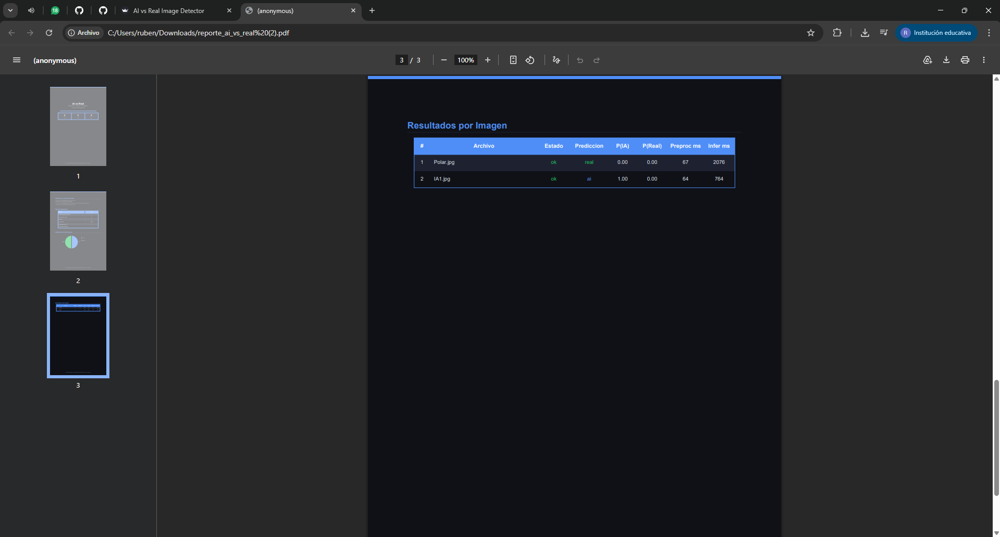

## EJECUCION DE PRUEBAS FUNCIONALES DE PROCESAMIENTO POR LOTE

1. Carga de múltiples imágenes.
A diferencia de la prueba anterior, se cargan 10 imágenes en total, correspondientes a 5 imágenes catalogadas como IA y 5 imágenes catalogadas como reales, utilizando nuevamente el botón “Browse Files”. Igual que antes, todas las imágenes aparecen inicialmente con estado “Pending”.
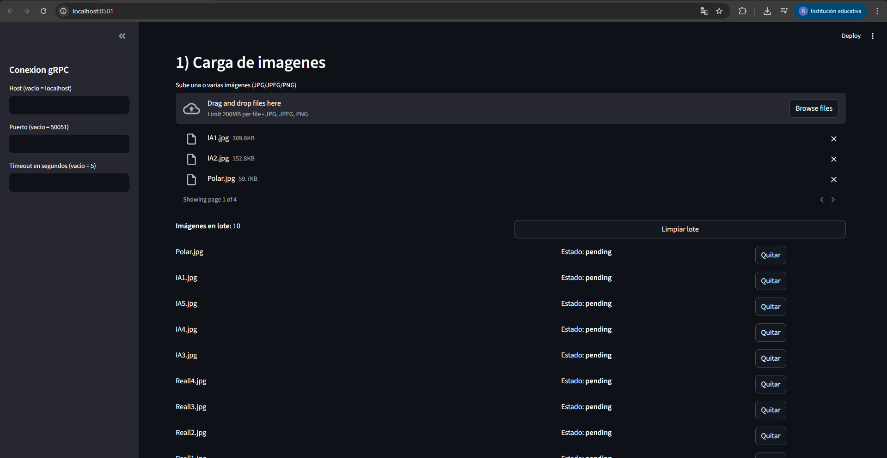
2. Procesamiento del lote.
Al presionar el botón “Analizar imágenes”, el sistema procesa correctamente las 10 imágenes, mostrando el estado “Éxito” para cada una de ellas.
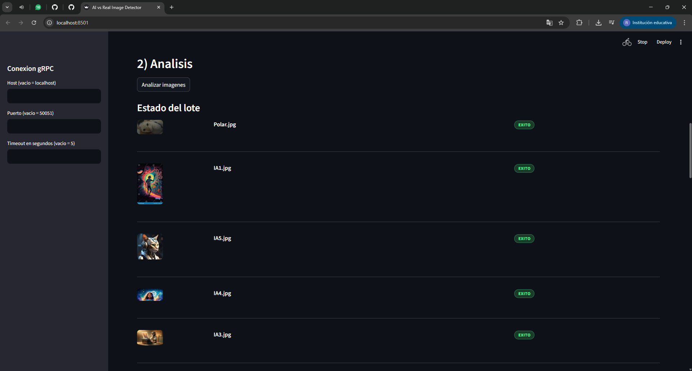
3. Verificación de resultados.
En la tabla de resultados se confirma que el sistema realizó correctamente la clasificación de todas las imágenes cargadas en el lote.
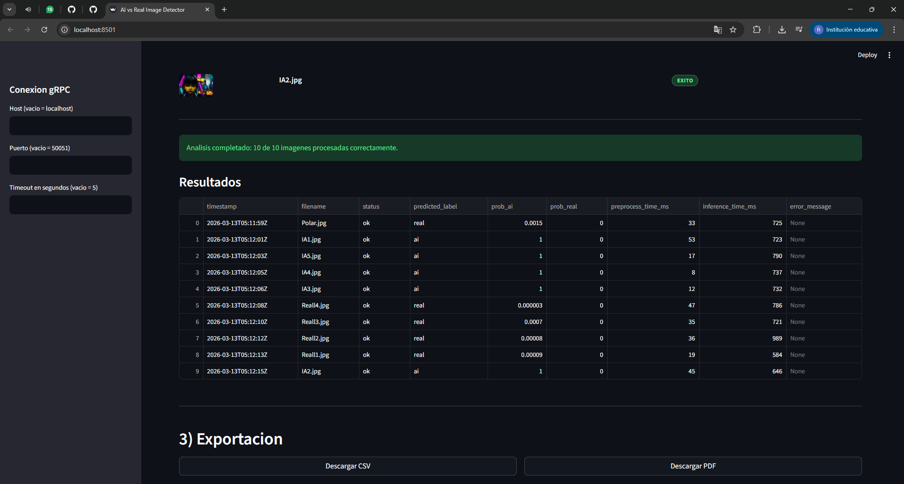 
4. Exportación del reporte en CSV.
Se verifica que el archivo CSV se genera correctamente y contiene los resultados correspondientes a las 10 imágenes procesadas.
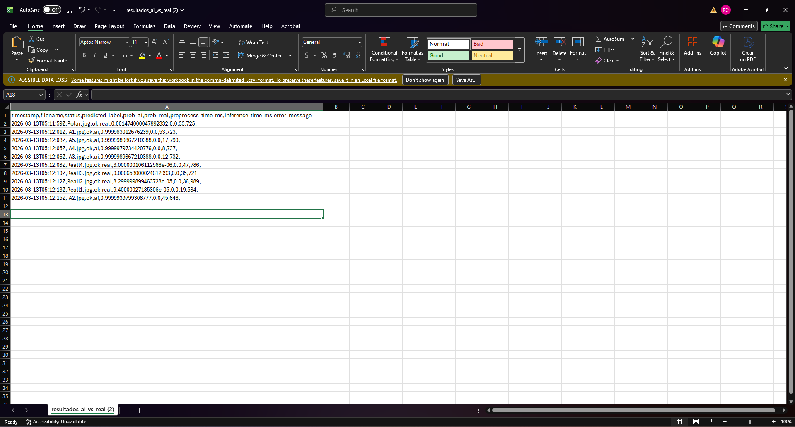
5. Exportación del reporte en PDF.
Al analizar el archivo PDF generado, se observa que el documento contiene la información correspondiente a las 10 imágenes procesadas, mostrando correctamente sus respectivas clasificaciones.
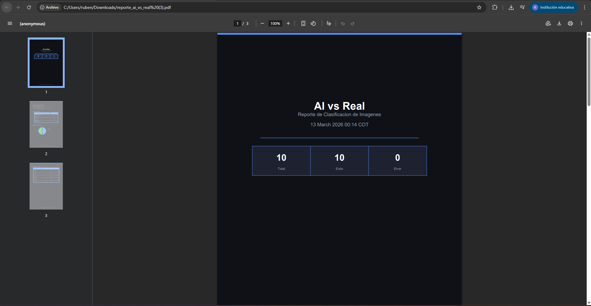
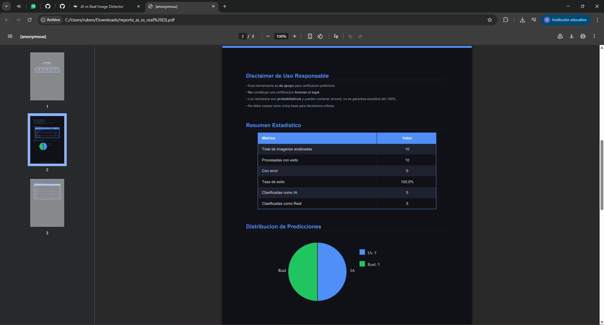
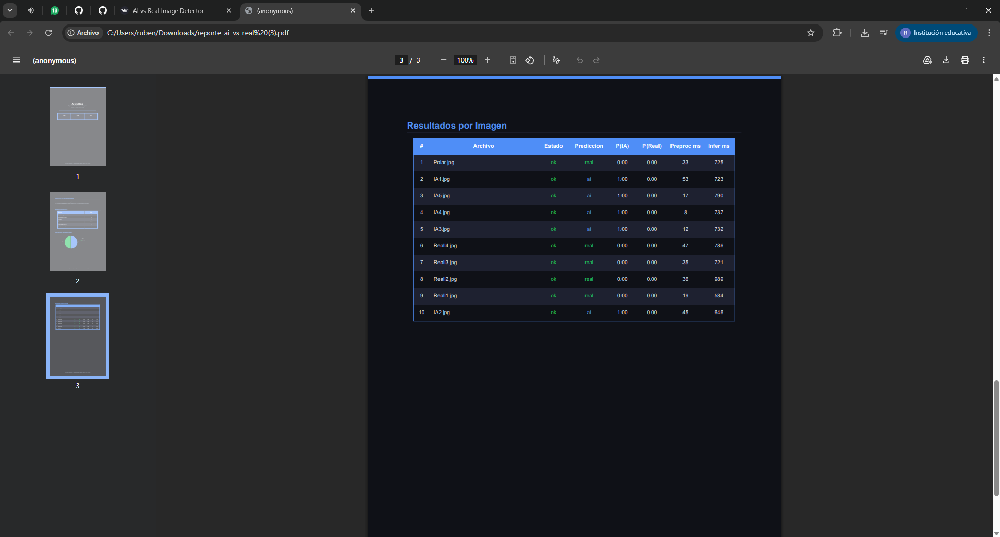

## VALIDACION DE MANEJO DE FORMATOS INVÁLIDOS Y ARCHIVOS CORRUPTOS

1. Prueba de archivo no válido con extensión de imagen.
Se crea un archivo de texto (.txt) y posteriormente se renombra con extensión .jpg para simular un archivo que aparenta ser una imagen pero no lo es. Al cargarlo en la aplicación, el sistema detecta correctamente que el archivo no corresponde a una imagen válida y muestra el mensaje de error correspondiente.
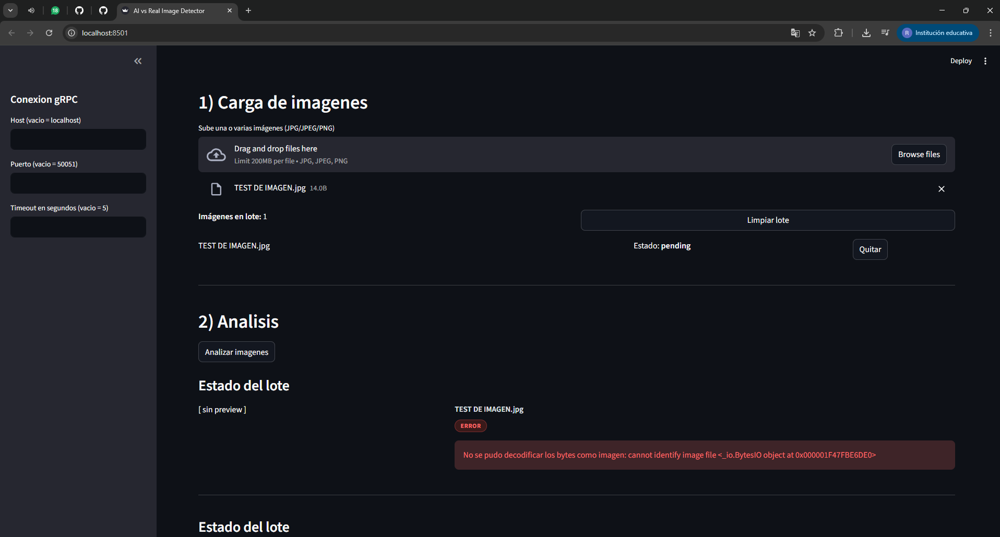
2. Prueba de imagen corrupta o no decodificable.
Se toma una imagen válida y se modifica su contenido utilizando un editor de texto (Bloc de notas), eliminando parte de su información para corromper el archivo. Al subir esta imagen a la aplicación, el sistema detecta correctamente que el archivo no puede ser procesado y muestra un mensaje de error.
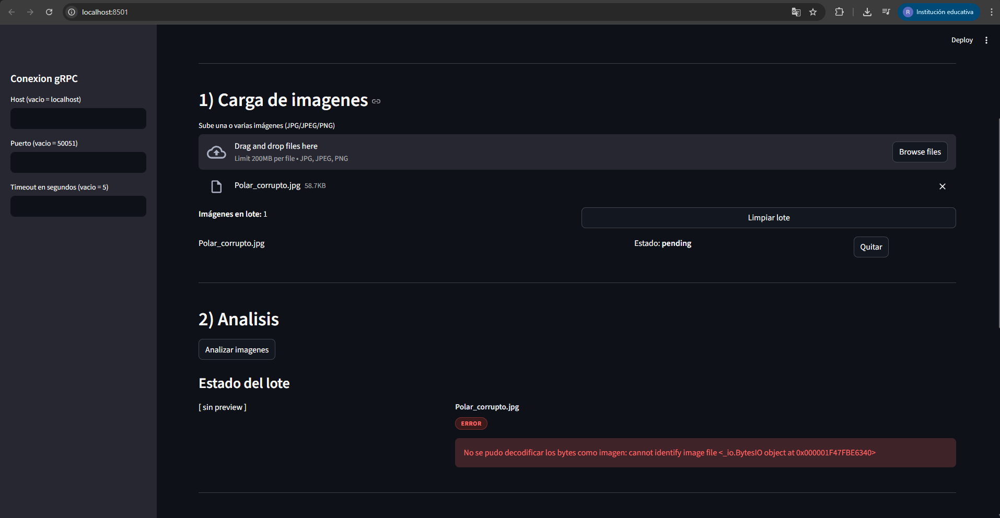
3. Verificación de mensajes de error (UX).
Se verifica que, ante archivos inválidos o corruptos, la aplicación muestra un mensaje de error indicando que la imagen no pudo ser procesada. Adicionalmente, el sistema informa la cantidad de imágenes procesadas correctamente y aquellas que presentaron errores.
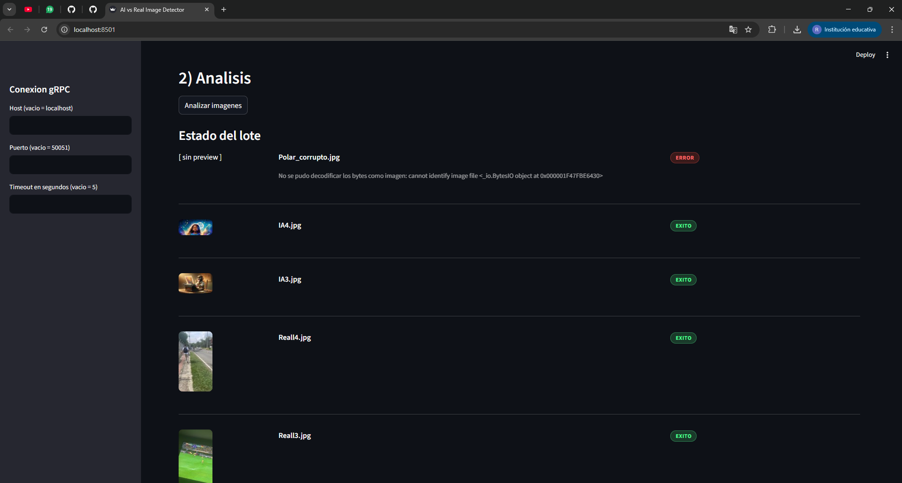
4. Prueba de continuidad del procesamiento por lote.
Se carga un lote de cinco imágenes, donde una de ellas está corrupta, con el objetivo de comprobar que el sistema continúa procesando las demás imágenes válidas. El sistema realiza el análisis correctamente para las imágenes válidas y registra el error únicamente para la imagen corrupta, demostrando que el procesamiento del lote no se interrumpe ante errores parciales.
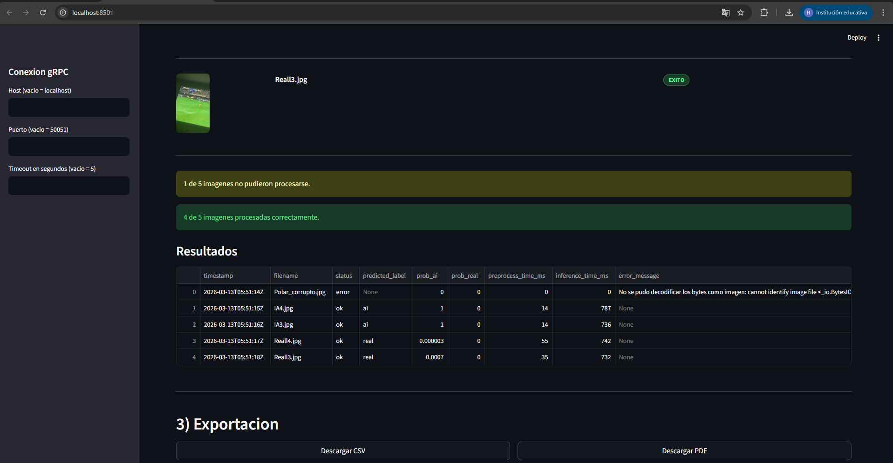
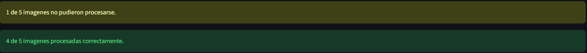