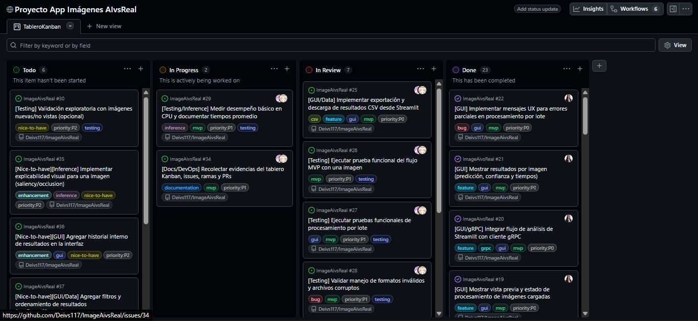
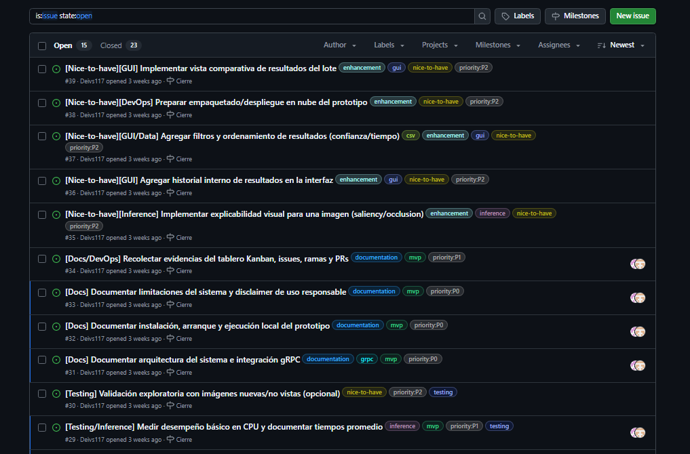
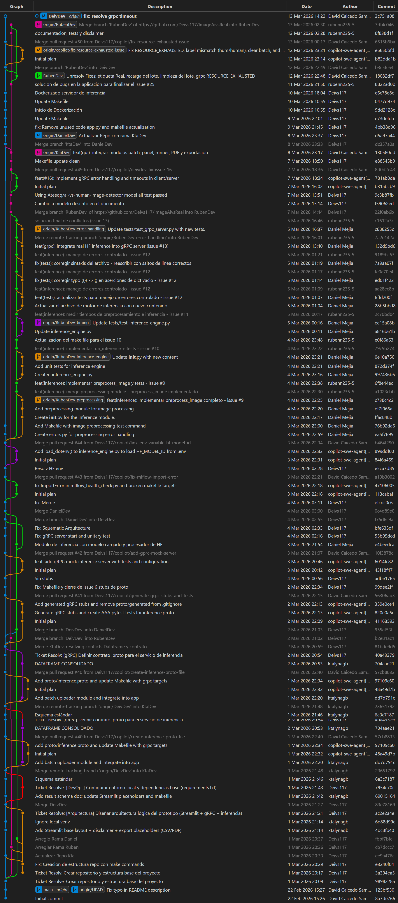

# Evidencia de uso de GitHub Projects en el proyecto

Para la gestión del desarrollo del prototipo App Imágenes AI vs Real, se utilizó GitHub Projects como herramienta de organización y seguimiento de tareas. Se implementó un tablero tipo Kanban que permitió visualizar el estado de las actividades del proyecto mediante las columnas Todo, In Progress, In Review y Done.

A través de este tablero se registraron diferentes issues que representan tareas técnicas, pruebas, documentación y mejoras del sistema. Cada issue fue clasificado utilizando labels como gui, testing, inference, documentation y niveles de prioridad, lo que facilitó la organización del trabajo y la trazabilidad de las actividades.

Durante el desarrollo, las tareas se fueron moviendo entre las diferentes columnas del tablero conforme avanzaba su implementación, permitiendo evidenciar el progreso del proyecto desde la planificación hasta su finalización.

Además, el flujo de desarrollo se gestionó mediante ramas de trabajo dentro del repositorio, incluyendo ramas específicas asociadas a diferentes componentes del sistema (por ejemplo, inferencia, preprocesamiento y manejo de errores). Esto permitió trabajar de forma organizada sobre funcionalidades específicas sin afectar la rama principal.

Finalmente, se utilizaron Pull Requests (PRs) para integrar algunos cambios en el repositorio. Estos PRs documentan la implementación de nuevas funcionalidades, corrección de errores y mejoras en la arquitectura del sistema, manteniendo un historial claro del desarrollo y facilitando el proceso de revisión y cierre de tareas.

Las capturas presentadas evidencian el uso de GitHub Projects como herramienta de gestión, mostrando el tablero Kanban del proyecto, la lista de issues creados, el historial de Pull Requests y las ramas utilizadas durante el desarrollo.

